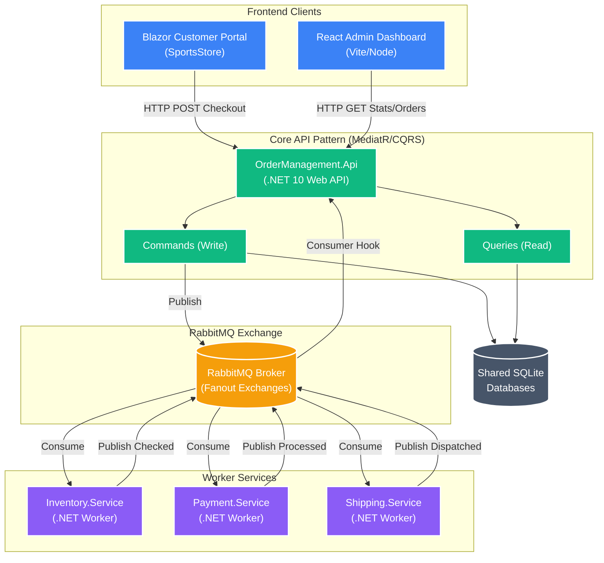

# Distributed Order Processing Platform — SportsStore

This repository contains the upgraded **SportsStore** application (from standard MVC .NET to a fully distributed architecture using .NET 10). It demonstrates event-driven microservices processing orders asynchronously.

The assignment delivery focuses on the distributed order workflow. Legacy Stripe artifacts from the earlier project remain in the repository, but the active checkout path for this solution uses the asynchronous RabbitMQ-based payment simulation service.

## Architecture 

The application is built using a **CQRS / Event-Driven Microservices** architecture with RabbitMQ.



## Key Technologies
- **.NET 10** (Preview)
- **Blazor Server** (Customer Portal)
- **React.js + Vite + TypeScript** (Admin Dashboard)
- **MediatR** (CQRS pattern)
- **RabbitMQ** (Message Broker)
- **Serilog** (Structured Logging)
- **AutoMapper** (DTO Mapping)
- **EF Core + SQLite** (Storage)
- **Docker Compose** (Container Orchestration)

## Service Responsibilities
- **SportsStore (Blazor Server)**: customer portal for browsing products, signing in, checkout, viewing previous orders, and tracking live order status.
- **OrderManagement.Api**: central API entry point, CQRS orchestration layer, order persistence, status tracking, and RabbitMQ publisher/consumer integration.
- **Inventory.Service**: validates and reserves stock, then emits inventory success or failure.
- **Payment.Service**: simulates asynchronous payment approval or rejection.
- **Shipping.Service**: creates shipment metadata and completes successful orders.
- **admin-dashboard**: operational dashboard for order monitoring, filtering, failure investigation, and order detail review.

## Event Workflow Lifecycle

When a customer places an order from the Blazor portal:
1.  **Order API** receives HTTP request → `CheckoutOrderCommand` creates order in DB as `Submitted`.
2.  **Order API** publishes `Inventory.Check`.
3.  **Inventory Worker** consumes `Inventory.Check` → simulates stock validation → publishes `Inventory.Completed` (Success/Fail).
4.  **Order API** consumes `Inventory.Completed` → updates DB. If Success, publishes `Payment.Requested`.
5.  **Payment Worker** consumes `Payment.Requested` → simulates payment gateway → publishes `Payment.Processed`.
6.  **Order API** consumes `Payment.Processed` → updates DB. If Success, publishes `Shipping.Requested`.
7.  **Shipping Worker** consumes `Shipping.Requested` → generates dispatch details → publishes `Shipping.Created`.
8.  **Order API** marks order as `Completed`.

If any step fails, the API marks the order as `Failed` with the reason.

## Frontend Features

### Customer Portal
- Product listing and product details
- Shopping cart and checkout
- Login/register with ASP.NET Core Identity
- My Orders scoped to the authenticated customer
- Live order tracking timeline

### Admin Dashboard
- Dashboard summary from live API metrics
- Orders table with status filters
- Failed orders view
- Order detail page with inventory, payment, shipping, correlation id, and workflow timeline

## How to Run

### Prerequisite
You need Docker and Docker Compose installed.

### Option 1: Docker Compose (All-in-one locally)

To run the entire distributed system (API, 3 Worker Services, RabbitMQ, Blazor App, and React Dashboard):

```bash
docker compose up --build
```

Access the applications at:
*   **Blazor Customer Portal**: `http://localhost:5002`
*   **React Admin Dashboard**: `http://localhost:3000`
*   **Order Management API**: `http://localhost:5001`
*   **RabbitMQ Management UI**: `http://localhost:15672` (guest/guest)

Seeded customer/admin account for demo:
* **Username**: `Admin`
* **Password**: `Secret123$`

### Option 2: Running via IDE / Dotnet CLI

If you want to debug individual services:
1. Bring up RabbitMQ: `docker run -d -p 5672:5672 -p 15672:15672 rabbitmq:3-management`
2. Start the API: `cd OrderManagement.Api && dotnet run`
3. Start Workers: `cd Inventory.Service && dotnet run`, `cd Payment.Service && dotnet run`, `cd Shipping.Service && dotnet run`
4. Start the Blazor portal: `cd SportsStore && dotnet run`
5. Run Dashboard: `cd admin-dashboard && npm run dev`

## CI/CD 
A GitHub actions workflow is configured in `.github/workflows/ci.yml`. It builds all .NET 10 code, runs MediatR unit tests tracking trx coverage results, and verifies the Node React build.

## Assumptions and Limitations
- SQLite is used to keep the setup simple and portable for local development and assessment.
- Payment processing is intentionally simulated asynchronously by `Payment.Service`; no external gateway is required for the assignment workflow.
- The admin dashboard uses live operational data from the API for summaries, filters, failures, and order detail views.
